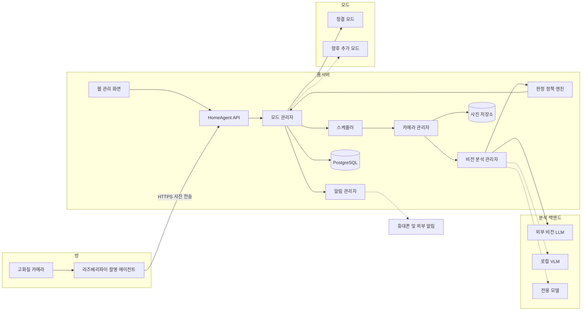
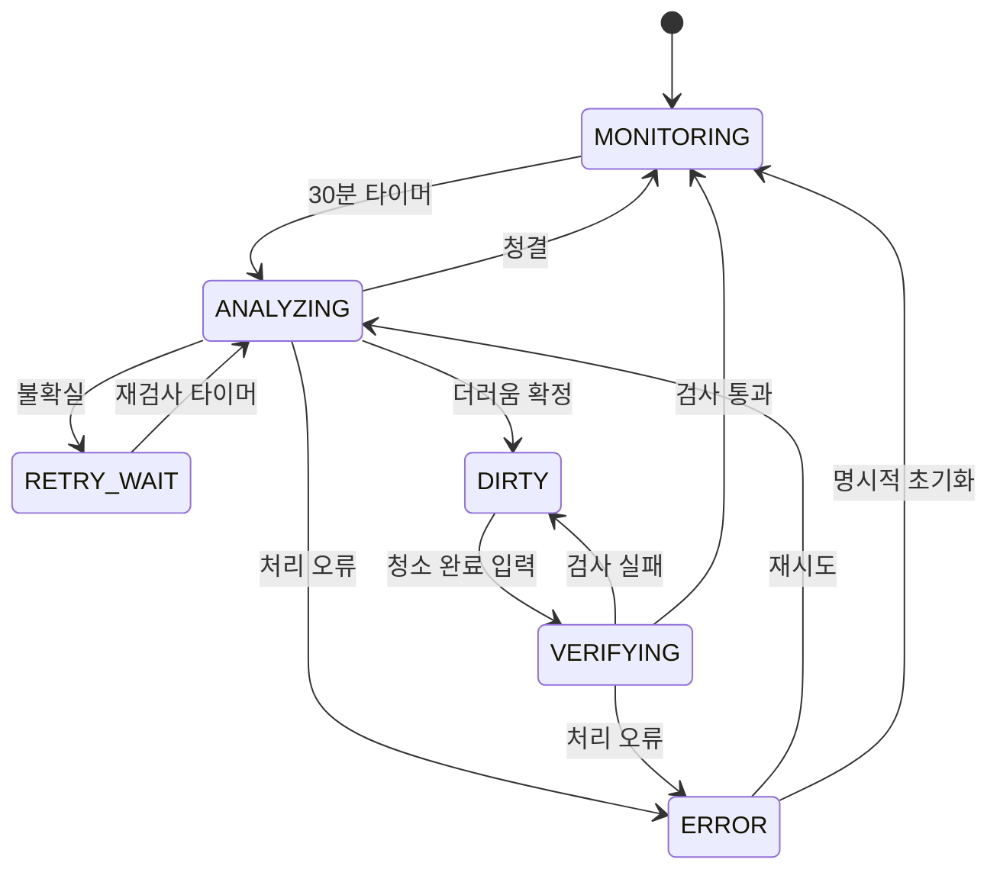

# HomeAgent 프로젝트 설계 및 개발 계획

> 이 문서는 HomeAgent의 요구사항, 아키텍처, 기술 선택, 개발 진행 상태와 작업 기록을 한곳에서 관리하기 위한 기준 문서다.  
> 구현 방향이 변경되면 코드보다 먼저 또는 코드와 함께 이 문서를 갱신한다.

---

## 0. 문서 정보

| 항목 | 내용 |
|---|---|
| 프로젝트명 | HomeAgent |
| 저장소 | `homeagent-backend`, `homeagent-web`, `homeagent-camera-agent` |
| 최초 작성일 | 2026-08-14 |
| 마지막 갱신일 | 2026-08-26 |
| 현재 단계 | 백엔드 장치·사진 업로드 계약 완료, 카메라 촬영·업로드 프로세서 연결 대기 |
| 최초 제공 모드 | 청결 모드(Cleanliness Mode) |
| 기준 시간대 | Asia/Seoul |
| 문서 담당 | 프로젝트 개발자 |

### 상태 표시 규칙

| 표시 | 상태 | 의미 |
|---|---|---|
| ⚪ | 미진행 | 아직 작업을 시작하지 않음 |
| 🟡 | 진행 중 | 현재 구현 또는 검증 중 |
| 🟢 | 완료 | 완료 조건과 검증 기준을 모두 만족함 |
| 🔴 | 차단 | 외부 요인, 결정 부족 또는 오류로 진행할 수 없음 |
| ⚫ | 보류 | 지금은 구현하지 않기로 결정함 |

### 문서 갱신 규칙

1. 작업을 시작할 때 상태를 `⚪ 미진행`에서 `🟡 진행 중`으로 변경한다.
2. 구현만 끝났다고 완료 처리하지 않는다. 테스트와 완료 조건까지 충족한 뒤 `🟢 완료`로 변경한다.
3. 각 작업의 `개발 코멘트`에는 구현 방식, 주요 파일, 테스트 결과와 남은 문제를 기록한다.
4. 아키텍처 또는 기술 선택이 바뀌면 `의사결정 기록`에 이유와 영향을 남긴다.
5. 오류나 미해결 사항은 `이슈 및 위험 기록`에 추가한다.
6. 날짜는 `YYYY-MM-DD` 형식을 사용한다.

---

## 1. 프로젝트 개요

HomeAgent는 방에 설치된 카메라를 이용해 생활 공간의 상태를 주기적으로 확인하고, 활성화된 모드에 따라 분석과 알림을 수행하는 홈 비전 플랫폼이다.

첫 번째 기능은 `청결 모드`다. 청결 모드는 활성 시간 동안 30분마다 고화질 사진을 촬영해 방의 청결 상태를 분석한다. 방이 더럽다고 판단되면 주기 검사를 중지하고 더러움 상태를 유지한다. 사용자가 청소 완료를 알리면 새 사진으로 청결도를 다시 검사하며, 검사에 통과한 경우에만 30분 주기 검사를 재개한다.

시스템은 청결 기능 하나에 종속되지 않는다. 향후 보안, 안전, 반려동물, 재실 확인 등의 모드를 추가할 수 있도록 공통 카메라·스케줄·분석·알림 기능과 개별 모드를 분리한다.

---

## 2. 프로젝트 목적

### 2.1 핵심 목적

- 실시간 영상을 계속 전송하지 않고 30분 간격의 고화질 사진만 사용해 데이터 사용량을 줄인다.
- 수면 시간과 사용자가 지정한 방해 금지 시간에는 촬영과 알림을 중지한다.
- 더러움 상태를 일회성 알림이 아닌 지속 상태로 관리한다.
- 청소 완료 후 재검사를 통과해야만 정상 감시 주기로 복귀하게 한다.
- 각 기능을 독립된 모드로 만들어 활성화·비활성화할 수 있게 한다.
- 추후 휴대폰 푸시, 메신저, Home Assistant 등의 알림 수단을 쉽게 추가한다.
- 실제 운영 데이터를 축적해 장기적으로 로컬 비전 모델 또는 전용 모델을 도입한다.

### 2.2 성공 기준

- 서버와 라즈베리파이가 재부팅되어도 모드와 청결 상태가 보존된다.
- 청결 모드가 활성화된 경우에만 정해진 스케줄로 촬영한다.
- 방해 금지 시간에는 카메라 촬영 요청이 발생하지 않는다.
- 더러움이 확정되면 30분 타이머가 멈춘다.
- 사용자가 청소 완료를 요청한 경우에만 재검사를 수행한다.
- 재검사를 통과한 시점부터 새로운 30분 타이머가 시작된다.
- 촬영 실패, 전송 실패, AI 분석 실패가 조용히 무시되지 않고 기록된다.
- 원본 사진은 설정된 보존 기간이 지나면 자동 삭제된다.
- 새로운 모드를 추가할 때 기존 카메라 및 스케줄 코드를 크게 수정하지 않는다.

### 2.3 초기 범위에서 제외되는 항목

- 24시간 실시간 동영상 스트리밍
- 최초 버전에서의 자체 비전 모델 학습
- 최초 버전에서의 iOS/Android 네이티브 앱
- 다수 사용자 및 상용 서비스 수준의 계정·결제 시스템
- 카메라가 움직이는 PTZ 제어
- 여러 집을 통합 관리하는 클라우드 서비스

---

## 3. 요구사항

### 3.1 기능 요구사항

| ID | 요구사항 | 우선순위 | 상태 | 검증 기준 |
|---|---|---:|---|---|
| FR-001 | 청결 모드를 활성화·비활성화할 수 있어야 한다. | 필수 | 🟡 진행 중 | API 완료, 웹 UI 연결 대기 |
| FR-002 | 활성 시간에는 기본 30분마다 고화질 사진을 촬영해야 한다. | 필수 | 🟡 진행 중 | 30분 예약·작업 큐 완료, 카메라 촬영 연결 대기 |
| FR-003 | 방해 금지 시간에는 촬영과 알림을 하지 않아야 한다. | 필수 | 🟡 진행 중 | 작업 생성 차단 완료, 실제 촬영·알림 통합 대기 |
| FR-004 | 촬영 사진을 비전 모델로 분석해야 한다. | 필수 | 🟡 진행 중 | 결과 스키마·저장 완료, 실제 비전 모델 연결 대기 |
| FR-005 | 분석 결과를 청결·불확실·더러움으로 판정해야 한다. | 필수 | 🟡 진행 중 | 분류별 상태 처리 완료, 임계값 정책 대기 |
| FR-006 | 불확실한 경우 짧은 시간 후 재촬영할 수 있어야 한다. | 권장 | 🟡 진행 중 | 5분 예약·자동 작업 생성 완료, 카메라 촬영 대기 |
| FR-007 | 더러움이 확정되면 더러움 상태를 유지해야 한다. | 필수 | 🟡 진행 중 | 재부팅 후에도 DIRTY 유지 |
| FR-008 | 더러움 상태에서는 일반 30분 타이머를 중지해야 한다. | 필수 | 🟢 완료 | DIRTY 중 예약 제거 및 정기 분석 시작 거부 |
| FR-009 | 사용자가 청소 완료 검사를 요청할 수 있어야 한다. | 필수 | 🟢 완료 | API로 VERIFYING 진입 및 중복 요청 안전 |
| FR-010 | 청결 검사에 통과해야 정상 타이머를 재개해야 한다. | 필수 | 🟡 진행 중 | 실패 시 DIRTY, 성공 시 MONITORING |
| FR-011 | 모드를 꺼도 내부 청결 상태는 보존해야 한다. | 필수 | 🟡 진행 중 | 재활성화 후 이전 상태 확인 |
| FR-012 | 촬영 및 분석 기록을 조회할 수 있어야 한다. | 권장 | ⚪ 미진행 | 웹에서 이벤트 이력 조회 |
| FR-013 | 사진 보존 기간과 자동 삭제를 지원해야 한다. | 필수 | 🟡 진행 중 | expires_at·보존 설정 완료, 삭제 작업 대기 |
| FR-014 | 카메라 연결 상태를 확인할 수 있어야 한다. | 필수 | 🟡 진행 중 | heartbeat·online/offline 계산 완료, 웹 표시 대기 |
| FR-015 | 향후 알림 제공자를 추가할 수 있어야 한다. | 필수 | ⚪ 미진행 | 공통 NotificationProvider 인터페이스 존재 |

### 3.2 비기능 요구사항

| ID | 요구사항 | 상태 | 목표 |
|---|---|---|---|
| NFR-001 | 개인정보 보호 | 🟡 진행 중 | 비공개 저장·경로 비노출 완료, 자동 삭제 대기 |
| NFR-002 | 장애 복구 | 🟡 진행 중 | 모드·예약 작업 복구 완료, 촬영 전송 복구 대기 |
| NFR-003 | 전송 보안 | 🟡 진행 중 | 해시 기반 장치 키 인증 완료, HTTPS 적용 대기 |
| NFR-004 | 중복 방지 | 🟡 진행 중 | 작업 임대·멱등 처리 완료, 에이전트 중복 촬영 방지 대기 |
| NFR-005 | 확장성 | ⚪ 미진행 | 기존 코어 수정 없이 신규 모드 추가 가능 |
| NFR-006 | 관측 가능성 | ⚪ 미진행 | 주요 이벤트와 오류에 구조화된 로그 사용 |
| NFR-007 | 유지보수성 | ⚪ 미진행 | 코어·모드·외부 어댑터 책임 분리 |

---

## 4. 주요 아키텍처 결정

| 결정 | 선택 | 이유 |
|---|---|---|
| 카메라 연결 | 라즈베리파이에 연결 | 서버 위치와 분리, 확장 용이, 전송 실패 큐 구성 가능 |
| 촬영 방식 | 30분 간격 고화질 정지 사진 | 실시간 영상보다 데이터와 연산 사용량이 적음 |
| 초기 AI | 외부 비전 LLM | 학습 데이터 없이 빠른 개발과 설명 가능한 결과 제공 |
| 장기 AI | 로컬 VLM + 외부 LLM 하이브리드 | 개인정보와 비용을 개선하면서 애매한 사례의 정확도 유지 |
| 자체 모델 학습 | 초기에는 미실시 | 개인별 청결 기준에 맞는 검증 데이터가 먼저 필요함 |
| 서버 구조 | 모듈형 모놀리스 | 초기 운영은 단순하게, 기능 경계는 명확하게 유지 |
| 장치 통신 | REST + HTTPS | 낮은 촬영 빈도에서 구현과 디버깅이 단순함 |
| 상태 저장 | PostgreSQL | 재부팅 복구, 상태 일관성과 확장성 확보 |
| 배포 | Docker Compose | 홈서버에서 반복 가능한 설치와 업데이트 제공 |

### 4.1 저장소 구성

HomeAgent는 개인 GitHub 계정에서 다음 3개의 비공개 저장소로 분리해 관리한다.

| 저장소 | 책임 |
|---|---|
| `homeagent-backend` | API, 데이터베이스, 모드 상태, 스케줄, 비전 분석과 알림 이벤트 |
| `homeagent-web` | 사용자 관리 화면, 모드 제어, 상태 및 기록 조회 |
| `homeagent-camera-agent` | 라즈베리파이 카메라 촬영, heartbeat, 사진 전송과 실패 큐 |

백엔드의 OpenAPI 명세를 API 계약의 기준으로 사용한다. 웹과 카메라 에이전트는 데이터베이스에 직접 접근하지 않고 버전이 명시된 백엔드 API만 사용한다.

### 4.2 Git 및 변경 기록 정책

- `main`에는 직접 개발하지 않는다.
- 모든 변경은 `agent/<작업명>` 브랜치에서 수행해 원격에 푸시한다.
- 사용자가 변경 내용을 확인하고 수동으로 `main`에 머지한다.
- 커밋 제목은 변경 목적이 바로 보이는 간결한 한글로 작성한다.
- 커밋 본문에는 구현 내용, 변경 이유와 영향을 한글로 기록한다.
- 코드 변경과 함께 이 문서의 진행 상태 및 개발 작업 기록을 갱신한다.
- 하나의 커밋에는 가능한 한 하나의 논리적인 변경만 포함한다.
- 비밀값, 실제 방 사진, 로그, 데이터베이스 파일과 모델 가중치는 커밋하지 않는다.

---

## 5. 전체 아키텍처



### 5.1 라즈베리파이 촬영 에이전트

책임:

- 카메라 초기화와 고화질 JPEG 촬영
- 서버가 발급한 작업 ID에 따른 촬영
- 사진과 촬영 메타데이터 전송
- 네트워크 장애 시 로컬 임시 큐 보관
- 전송 성공 후 임시 파일 삭제
- 주기적인 heartbeat 전송
- 촬영 중 여부와 장치 오류 보고

책임이 아닌 것:

- 청결 상태의 최종 판단
- 모드 상태 변경
- 알림 전송
- 장기 사진 보관
- 최초 버전에서의 무거운 AI 추론

### 5.2 HomeAgent 코어

공통 기능을 제공하며 특정 모드의 청결 기준을 직접 알지 않는다.

- 모드 등록, 활성화 및 비활성화
- 전역 방해 금지 정책
- 촬영 요청 병합과 카메라 잠금
- 스케줄 생성 및 복구
- 사진 보존과 삭제
- 비전 분석 제공자 선택
- 알림 제공자 호출
- 오류 기록과 재시도

### 5.3 모드 관리자

각 모드에는 다음 공통 인터페이스를 적용한다.

```typescript
interface HomeAgentMode {
  id: string;
  name: string;
  enabled: boolean;

  enable(): Promise<void>;
  disable(): Promise<void>;
  onSchedule(): Promise<void>;
  onCaptured(imageId: string): Promise<void>;
  getStatus(): Promise<ModeStatus>;
}
```

여러 모드가 비슷한 시각에 사진을 요청하면 카메라 관리자가 요청을 병합해 한 장을 여러 모드에 전달한다.

### 5.4 비전 분석 관리자

- 외부 비전 LLM, 로컬 VLM, 전용 모델을 동일한 인터페이스로 감싼다.
- 모델 응답을 공통 분석 결과 형식으로 변환한다.
- 모델명, 프롬프트 버전, 처리 시간과 오류를 기록한다.
- AI는 분석 결과만 반환하며 시스템 상태를 직접 변경하지 않는다.
- 최종 상태 전이는 판정 정책 엔진과 모드가 결정한다.

### 5.5 알림 관리자

```typescript
interface NotificationProvider {
  send(event: NotificationEvent): Promise<void>;
}
```

초기에는 웹 이벤트 기록만 구현하고 추후 다음 제공자를 추가한다.

- 브라우저 알림
- Firebase Cloud Messaging
- Telegram 또는 기타 메신저
- Home Assistant
- 네이티브 휴대폰 앱

---

## 6. 청결 모드 상세 설계

### 6.1 활성 상태와 실행 상태 분리

```json
{
  "mode_id": "cleanliness",
  "enabled": true,
  "runtime_state": "DIRTY",
  "next_run_at": null,
  "updated_at": "2026-08-14T12:00:00+09:00"
}
```

- `enabled`: 사용자가 모드를 켰는지 나타낸다.
- `runtime_state`: 모드 내부의 실제 실행 상태다.
- 비활성화는 상태 초기화가 아니라 일시 중지다.
- 방해 금지 시간은 실행 상태가 아니라 스케줄러의 실행 조건이다. 따라서 `DIRTY` 같은 상태를 덮어쓰지 않는다.
- 상태 초기화가 필요하면 별도의 명시적 기능으로 제공한다.

### 6.2 상태 정의

| 상태 | 의미 | 다음 동작 |
|---|---|---|
| MONITORING | 정상 주기 검사 상태 | 30분 후 촬영 |
| ANALYZING | 사진 촬영 또는 분석 중 | 결과에 따라 상태 전환 |
| RETRY_WAIT | 불확실 판정 후 재검사 대기 | 기본 5분 후 재촬영 |
| DIRTY | 더러움이 확정됨 | 청소 완료 입력 대기 |
| VERIFYING | 청소 완료 후 청결 검사 중 | 통과 또는 실패 처리 |
| ERROR | 촬영·전송·분석 오류 | 정책에 따라 재시도 |

`DISABLED`와 `SLEEPING`은 실행 상태로 저장하지 않는다. 비활성 여부는 `enabled`에 저장하고, 방해 금지 여부는 현재 시각과 설정으로 계산한다. 이 구조는 모드를 끄거나 수면 시간이 시작되어도 `DIRTY`를 포함한 내부 상태를 그대로 보존한다.

### 6.3 상태 전이



모드가 비활성 상태이거나 방해 금지 시간인 경우 스케줄러는 위 전이를 실행하지 않는다. 기존 `runtime_state`는 변경하지 않으며, 다시 실행 가능한 시점에 상태별 정책을 적용한다.

### 6.4 정상 검사 흐름

1. 스케줄러가 실행 대상 모드를 조회한다.
2. 청결 모드가 활성화 상태인지 확인한다.
3. 전역 및 모드별 방해 금지 시간을 확인한다.
4. 현재 상태가 `MONITORING`인지 확인한다.
5. 카메라 관리자에 고유 작업 ID로 촬영을 요청한다.
6. 라즈베리파이가 사진을 촬영해 홈서버에 전송한다.
7. 사진 품질을 확인하고 비전 분석을 실행한다.
8. 정책 엔진이 청결·불확실·더러움을 판정한다.
9. 청결이면 분석 성공 시점부터 30분 후를 예약한다.
10. 불확실이면 기본 5분 후 재검사를 예약한다.
11. 더러움이면 `DIRTY`로 전환하고 일반 타이머를 중지한다.

### 6.5 청소 완료 검사 흐름

1. 사용자가 웹 또는 API에서 `청소 완료`를 요청한다.
2. 현재 상태가 `DIRTY`인지 검사한다.
3. 상태를 `VERIFYING`으로 변경한다.
4. 새로운 사진을 촬영하고 분석한다.
5. 이전 문제 항목과 전체 청결 상태를 함께 확인한다.
6. 통과하면 `MONITORING`으로 전환한다.
7. 통과 시점부터 30분 후를 다음 검사로 예약한다.
8. 실패하면 남은 문제를 저장하고 다시 `DIRTY`로 전환한다.

### 6.6 재활성화 정책

| 비활성화 전 상태 | 다시 활성화했을 때 동작 |
|---|---|
| MONITORING | 즉시 한 번 검사한 후 정상 주기 시작 |
| DIRTY | 더러움 상태를 유지하고 청소 완료 입력 대기 |
| VERIFYING | 미완료 검사를 폐기하고 DIRTY로 복귀 |
| ANALYZING | 중단된 작업을 실패 처리한 뒤 재시도 정책 적용 |
| RETRY_WAIT | 남은 재검사 시각을 복구하거나 즉시 재검사 |
| ERROR | 장치 및 분석 제공자 상태 확인 후 재시도 |

---

## 7. 판정 및 AI 전략

### 7.1 초기 전략

초기에는 외부 비전 LLM을 사용한다. 학습 데이터 없이 빠르게 시작할 수 있고, 단순 점수뿐 아니라 더러운 이유와 청소 방법을 구조화해서 받을 수 있기 때문이다.

권장 응답 형식:

```json
{
  "cleanliness_score": 68,
  "classification": "dirty",
  "confidence": 0.91,
  "image_quality": "good",
  "issues": [
    {
      "category": "clothes_on_floor",
      "severity": 3,
      "location": "침대 왼쪽 바닥",
      "instruction": "바닥에 놓인 옷을 수납하세요."
    }
  ]
}
```

### 7.2 초기 판정 기준

| 점수 | 판정 | 동작 |
|---:|---|---|
| 0~30 | 청결 | 30분 주기 유지 |
| 31~59 | 불확실 | 5분 후 재검사 |
| 60~100 | 더러움 | DIRTY 전환 및 알림 이벤트 생성 |

위 임계값은 초기 가정이며 실제 사진으로 평가한 후 조정한다.

추가 규칙:

- 사진이 너무 어둡거나 흐리면 청결 판정을 하지 않는다.
- 카메라가 가려졌으면 장치 오류로 분류한다.
- 동일 문제의 알림이 짧은 시간에 반복되지 않도록 억제한다.
- 음식물, 액체, 위험한 전선 등은 일반 점수와 별도의 위험 규칙을 적용할 수 있다.
- 모델의 낮은 신뢰도는 `불확실` 판정으로 처리한다.

### 7.3 장기 전략

1. 외부 비전 LLM으로 실제 사용 사례를 수집한다.
2. 사용자가 AI 판정을 승인하거나 수정할 수 있게 한다.
3. 검증된 청소 전후 데이터를 데이터셋으로 분리한다.
4. 홈서버에서 로컬 VLM을 평가한다.
5. 로컬 모델이 확실한 사례는 로컬에서 처리한다.
6. 애매한 사례만 외부 비전 LLM에 전송한다.
7. 데이터가 충분하면 청결 전용 분류기 또는 객체 탐지 모델을 학습한다.

---

## 8. 기술 스택

| 영역 | 초기 선택 | 비고 |
|---|---|---|
| 카메라 장치 | Raspberry Pi + Camera Module 3 Wide | 기존 USB 웹캠으로 대체 가능 |
| 장치 OS | Raspberry Pi OS | systemd로 에이전트 자동 실행 |
| 장치 프로그램 | Python, Picamera2 또는 rpicam-still | 촬영·전송·임시 큐 담당 |
| 백엔드 | Python FastAPI | API와 내부 모듈 구현 |
| 데이터베이스 | PostgreSQL | 상태, 기록, 설정 저장 |
| 스케줄러 | APScheduler 또는 DB 기반 작업 스케줄 | 재부팅 복구 필요 |
| 사진 저장소 | 홈서버 로컬 디스크 | 확장 시 MinIO 가능 |
| 프론트엔드 | React + Vite | 관리 화면 및 상태 확인 |
| 배포 | Docker Compose | 서버 구성 재현 |
| 리버스 프록시 | Caddy 또는 Nginx | HTTPS와 외부 진입점 |
| 장치 통신 | REST + HTTPS | 필요 시 MQTT 추가 |
| 초기 분석 | 외부 비전 LLM | 구조화된 JSON 결과 사용 |
| 장기 분석 | 로컬 VLM + 외부 LLM | 확신도 기반 라우팅 |
| 초기 알림 | 웹 이벤트 | 추후 FCM, 메신저, HA 추가 |

---

## 9. 데이터 모델 초안

### devices

| 필드 | 설명 |
|---|---|
| id | 장치 고유 ID |
| device_key | 사람이 관리하는 고유 장치 키 |
| name | 사용자 표시 이름 |
| room_name | 설치된 방 이름 |
| enabled | 장치 사용 가능 여부 |
| last_heartbeat_at | 마지막 상태 보고 시각 |
| last_agent_version | 마지막 에이전트 버전 |
| last_camera_status | ready, error 등 마지막 카메라 상태 |
| metadata_json | 장치 모델 등 확장 메타데이터 |
| api_key_hash | 장치 인증 키 해시 |

### modes

| 필드 | 설명 |
|---|---|
| id | 모드 고유 ID |
| type | cleanliness 등 모드 타입 |
| name | 사용자 표시 이름 |
| enabled | 활성화 여부 |
| runtime_state | 모드 내부 실행 상태 |
| config | 모드별 JSON 설정 |
| next_run_at | 다음 실행 시각 |
| updated_at | 마지막 상태 변경 시각 |

### mode_runs

| 필드 | 설명 |
|---|---|
| id | 영속 실행 작업 ID |
| mode_id | 실행 대상 모드 |
| mode_state_version | 작업 생성 시 모드 버전, 중복 방지 키 |
| trigger | schedule_due 또는 retry_due |
| status | queued, processing, completed, failed |
| scheduled_for | 원래 예약 시각 |
| created_at | 작업 생성 시각 |
| error_message | 실패 원인 |
| assigned_device_id | 현재 작업을 임대한 장치 |
| lease_expires_at | 처리 임대 만료 시각 |
| attempt_count | 작업 수령 시도 횟수 |

### captures

| 필드 | 설명 |
|---|---|
| id | 사진 ID |
| run_id | 고유 촬영 작업 ID |
| device_id | 촬영 장치 |
| captured_at | 실제 촬영 시각 |
| content_type / size_bytes | 검증된 MIME과 파일 크기 |
| sha256 | 파일 무결성 해시 |
| width / height | 검증된 이미지 해상도 |
| file_path | 비공개 저장 경로 |
| quality_status | valid, dark, blurred, blocked 등 |
| expires_at | 자동 삭제 시각 |

### analyses

| 필드 | 설명 |
|---|---|
| id | 분석 ID |
| capture_id | 분석한 사진 |
| mode_id | 분석을 요청한 모드 |
| provider | 외부 또는 로컬 분석 제공자 |
| model | 사용 모델명 |
| prompt_version | 프롬프트 버전 |
| score | 청결 점수 |
| classification | clean, uncertain, dirty |
| confidence | 모델 신뢰도 |
| result_json | 원본 구조화 결과 |
| created_at | 분석 시각 |

### cleanliness_issues

| 필드 | 설명 |
|---|---|
| id | 문제 ID |
| analysis_id | 관련 분석 |
| category | 옷, 쓰레기, 컵 등의 분류 |
| severity | 심각도 |
| location | 사진에서의 위치 설명 |
| instruction | 사용자에게 보여줄 정리 방법 |
| resolved | 해결 여부 |

### events / notifications

모드 상태 변화와 알림 발송 이력을 별도로 저장한다. 알림 재시도와 중복 억제를 위해 이벤트 ID와 제공자별 상태를 기록한다.

---

## 10. API 초안

### 장치 API

| 메서드 | 경로 | 목적 |
|---|---|---|
| POST | `/api/v1/devices/register` | 카메라 장치 등록 및 API 키 최초 발급 |
| GET | `/api/v1/devices` | 장치와 연결 상태 조회 |
| POST | `/api/v1/devices/heartbeat` | 장치 상태 보고 |
| POST | `/api/v1/devices/commands/claim` | 대기 작업을 임대 방식으로 수령 |
| POST | `/api/v1/devices/commands/{run_id}/complete` | 촬영 완료 보고 |
| POST | `/api/v1/devices/commands/{run_id}/fail` | 촬영 실패·재시도 보고 |
| POST | `/api/v1/devices/commands/{run_id}/capture` | JPEG 저장과 작업 완료를 한 흐름으로 처리 |

### 모드 API

| 메서드 | 경로 | 목적 |
|---|---|---|
| POST | `/api/v1/modes` | 모드 인스턴스 등록 |
| GET | `/api/v1/modes` | 전체 모드와 상태 조회 |
| GET | `/api/v1/modes/{instance_key}` | 단일 모드 상태 조회 |
| POST | `/api/v1/modes/{instance_key}/enable` | 모드 활성화 |
| POST | `/api/v1/modes/{instance_key}/disable` | 모드 비활성화 |
| PATCH | `/api/v1/modes/{instance_key}/config` | 검사 간격과 기준 변경(예정) |
| POST | `/api/v1/modes/{instance_key}/analysis/start` | 정기·재시도 분석 시작 |
| POST | `/api/v1/modes/{instance_key}/analysis/result` | 가짜 또는 실제 제공자의 구조화 결과 반영 |
| POST | `/api/v1/modes/{instance_key}/cleaning-complete` | 청소 완료 검사 요청 |

### 기록 API

| 메서드 | 경로 | 목적 |
|---|---|---|
| GET | `/api/events` | 상태 및 오류 이벤트 조회 |
| GET | `/api/captures` | 촬영 목록 조회 |
| GET | `/api/captures/{id}` | 권한 확인 후 사진 조회 |
| DELETE | `/api/captures/{id}` | 사진 수동 삭제 |

---

## 11. 보안 및 개인정보 보호

- 장치마다 별도의 인증 키를 발급한다.
- API 키와 비밀번호는 평문으로 DB에 저장하지 않는다.
- 홈 네트워크 내부에서도 HTTPS 사용을 목표로 한다.
- 원격 접속은 공유기 포트 직접 개방보다 VPN 또는 Tailscale을 우선한다.
- 사진 파일은 공개 URL로 노출하지 않는다.
- 원본 사진 기본 보존 기간은 72시간으로 시작하되 사용자가 변경할 수 있게 한다.
- 만료된 사진은 주기적으로 자동 삭제한다.
- 사진이 삭제되어도 필요하면 점수와 이벤트 기록은 유지할 수 있다.
- 외부 AI 전송 여부를 설정에서 끌 수 있게 설계한다.
- 방해 금지 시간에는 알림뿐 아니라 촬영 요청 자체를 생성하지 않는다.
- 촬영 LED와 선택적인 물리 셔터 또는 카메라 전원 차단을 고려한다.
- 로그에 사진 바이너리, 인증 키 또는 민감한 외부 API 응답을 그대로 남기지 않는다.

---

## 12. 오류 및 복구 정책

| 상황 | 처리 방안 |
|---|---|
| 카메라 연결 끊김 | 장치를 OFFLINE으로 표시하고 재연결 감시 |
| 사진 촬영 실패 | 작업 실패 기록 후 제한 횟수 재시도 |
| 사진 전송 실패 | 라즈베리파이 로컬 큐에 저장 후 재전송 |
| 서버 재부팅 | DB의 모드 상태와 next_run_at으로 복구 |
| 외부 AI 장애 | 지수 백오프 재시도 후 ERROR 이벤트 생성 |
| AI JSON 형식 오류 | 한 번 교정 요청 후 실패 처리 |
| 어둡거나 흐린 사진 | 청결 판정을 하지 않고 품질 오류로 재촬영 |
| 중복 작업 | job_id의 고유 제약으로 중복 처리 방지 |
| 비활성화 중 분석 완료 | 결과는 기록하되 모드 상태는 변경하지 않음 |
| 방해 금지 시작 후 작업 도착 | 촬영 전이면 취소, 촬영 후이면 정책에 따라 저장만 수행 |

---

## 13. 개발 단계 및 진행 상황

### 전체 진행 현황

| 단계 | 내용 | 상태 | 완료일 | 개발 코멘트 |
|---:|---|---|---|---|
| 0 | 요구사항 및 아키텍처 설계 | 🟢 완료 | 2026-08-14 | 최초 요구사항과 모드 기반 구조를 본 문서에 통합함 |
| 1 | 저장소 및 개발 환경 구성 | 🟢 완료 | 2026-08-26 | Docker Compose 통합 검증까지 완료 |
| 2 | 라즈베리파이 촬영 에이전트 | 🟡 진행 중 | - | 설정·장치 등록·heartbeat 기반 완료, 촬영·업로드 프로세서 연결 대기 |
| 3 | HomeAgent 서버 코어 | 🟡 진행 중 | - | FastAPI·PostgreSQL 기반과 공통 모드 저장 구조 완료 |
| 4 | 청결 모드와 상태 머신 | 🟡 진행 중 | - | 상태 모델·전이 API·영속 스케줄 연동 완료, 실제 분석기 연결 대기 |
| 5 | 외부 비전 LLM 분석 | 🟡 진행 중 | - | 영역별 JSON 결과 계약 완료, 실제 제공자 연동 대기 |
| 6 | 웹 관리 화면 | ⚪ 미진행 | - | - |
| 7 | 보안·개인정보·장애 복구 | ⚪ 미진행 | - | - |
| 8 | 통합 테스트 및 MVP 운영 | ⚪ 미진행 | - | - |
| 9 | 휴대폰 및 외부 알림 | ⚫ 보류 | - | MVP 이후 진행 |
| 10 | 로컬 VLM 및 전용 모델 | ⚫ 보류 | - | 데이터 축적 후 진행 |

### 단계 0. 요구사항 및 아키텍처 설계

목표: 구현 전에 시스템 경계, 책임과 상태 전이를 명확히 한다.

| 작업 | 상태 | 완료 조건 | 개발 코멘트 |
|---|---|---|---|
| 최초 요구사항 정리 | 🟢 완료 | 촬영·수면·더러움 유지·재검사 요구 반영 | 2026-08-14: 사용자 요구사항을 정리함 |
| 모드 기반 구조 정의 | 🟢 완료 | 활성/비활성과 내부 상태 분리 | 2026-08-14: 청결 모드를 첫 번째 확장 모드로 정의함 |
| 전체 아키텍처 결정 | 🟢 완료 | 장치·서버·AI·알림 경계 정의 | 2026-08-14: 라즈베리파이 촬영, 홈서버 제어 구조로 결정함 |
| 개발 계획 문서화 | 🟢 완료 | 본 문서 생성 | 2026-08-14: 단계별 상태와 기록 양식을 추가함 |

### 단계 1. 저장소 및 개발 환경 구성

목표: 서버, 장치 에이전트와 웹을 독립적으로 개발하고 실행할 수 있는 기본 구조를 만든다.

| 작업 | 상태 | 완료 조건 | 개발 코멘트 |
|---|---|---|---|
| 백엔드 Git 저장소 초기화 | 🟢 완료 | 원격 main 기준 브랜치와 README 생성 | 2026-08-19: `homeagent-backend` 최초 커밋 및 푸시 완료 |
| 백엔드 애플리케이션 구조 생성 | 🟢 완료 | API, core, db, migrations, tests 책임 분리 | 2026-08-20: FastAPI 패키지 구조 생성 |
| 환경 변수 예시 작성 | 🟢 완료 | 비밀값 없이 `.env.example` 제공 | DB 주소·로그·연결 제한 시간 제공 |
| Docker Compose 작성 | 🟢 완료 | API와 PostgreSQL이 한 명령으로 실행 | 2026-08-26: 이미지 빌드, DB healthcheck와 API 기동 확인 |
| Alembic 마이그레이션 구성 | 🟢 완료 | 기준 migration과 head 조회 성공 | `20260820_0001` 기준선 생성 |
| 코드 품질 도구 설정 | 🟢 완료 | formatter, linter, type checker 실행 가능 | Ruff와 strict mypy 통과 |
| 테스트 실행 환경 구성 | 🟢 완료 | 기본 테스트 명령 성공 | 6개 통과, 커버리지 94.81% |
| 개발용 README 작성 | 🟢 완료 | 설치와 실행 방법 재현 가능 | Docker·로컬 실행 및 검증 명령 기록 |

### 단계 2. 라즈베리파이 촬영 에이전트

목표: 서버 명령에 따라 안정적으로 사진을 촬영하고 전송한다.

| 작업 | 상태 | 완료 조건 | 개발 코멘트 |
|---|---|---|---|
| 카메라 장치 선정 및 설치 | ⚪ 미진행 | 방 전체를 확인할 수 있는 고정 화각 확보 | - |
| 수동 고화질 촬영 구현 | ⚪ 미진행 | 명령 한 번으로 JPEG 생성 | - |
| 서버 장치 등록 구현 | 🟢 완료 | 인증된 장치 ID 발급 | 2026-08-26: 실제 카메라 에이전트 등록과 재인증 정보 저장 확인 |
| heartbeat 구현 | 🟢 완료 | 서버에서 온라인 상태 확인 | 2026-08-26: 실제 에이전트 heartbeat로 online·ready·버전 정보 확인 |
| 촬영 명령 수신 구현 | 🟡 진행 중 | job_id에 따라 한 번만 촬영 | claim 계약 완료, 에이전트 구현 대기 |
| 사진 업로드 구현 | 🟡 진행 중 | 메타데이터와 사진 전송 성공 | 백엔드 계약·저장 완료, 에이전트 연결 대기 |
| 실패 전송 큐 구현 | ⚪ 미진행 | 네트워크 복구 후 자동 재전송 | - |
| systemd 자동 실행 | ⚪ 미진행 | 부팅 후 에이전트 자동 시작 | - |
| 24시간 안정성 시험 | ⚪ 미진행 | 누락·중복 없이 예약 촬영 성공 | - |

### 단계 3. HomeAgent 서버 코어

목표: 모든 모드가 공유하는 장치, 스케줄, 사진과 상태 관리 기능을 구현한다.

| 작업 | 상태 | 완료 조건 | 개발 코멘트 |
|---|---|---|---|
| FastAPI 기본 서버 | 🟢 완료 | 상태 확인 API 응답 | 2026-08-20: 생존·준비 상태 API 구현 |
| PostgreSQL 연결 및 migration | 🟢 완료 | 스키마 생성과 롤백 가능 | 2026-08-26: 실제 PostgreSQL에서 다섯 migration 적용 확인 |
| 장치 인증 | 🟢 완료 | 미인증 장치 요청 거부 | 2026-08-26: 일회성 원문 키·PBKDF2 해시 저장과 비활성 장치 차단 검증 |
| 장치 및 heartbeat API | 🟢 완료 | 온라인·오프라인 상태 계산 | 2026-08-26: 등록·목록·heartbeat와 재시작 후 인증 유지 확인 |
| 모드 등록 인터페이스 | 🟢 완료 | 청결 모드 등록 가능 | 2026-08-26: 공통 등록·목록·단건 조회 API 구현 |
| 모드 활성·비활성 API | 🟢 완료 | DB 상태 유지 및 중복 요청 안전 | 2026-08-26: 상태 보존과 멱등 재요청 검증 완료 |
| 영속 스케줄러 | 🟢 완료 | 재부팅 후 다음 작업 복구 | 2026-08-26: DB 잠금·영속 큐·재시작 복구 검증 |
| 카메라 작업 관리자 | 🟢 완료 | 촬영 생성·완료·실패 추적 | 2026-08-26: 임대 claim·완료·재시도·최종 실패와 경합 방지 구현 |
| 촬영 요청 병합 | ⚪ 미진행 | 같은 시간대 요청에 사진 한 장 사용 | - |
| 사진 저장 및 조회 | 🟡 진행 중 | 인증된 요청만 사진 조회 | JPEG 비공개 저장 완료, 관리자 조회 API 대기 |
| 이벤트 기록 | 🟡 진행 중 | 주요 상태 변화가 DB에 기록됨 | 상태 전이 이력 모델·서비스 구현, 조회 API 대기 |

### 단계 4. 청결 모드와 상태 머신

목표: 요구사항의 핵심인 지속 가능한 청결 상태와 재검사 흐름을 구현한다.

| 작업 | 상태 | 완료 조건 | 개발 코멘트 |
|---|---|---|---|
| 모드·상태 이력 데이터 모델 | 🟢 완료 | PostgreSQL 스키마와 migration 적용 | 2026-08-26: `modes`, `mode_state_history` 구현 |
| 상태 enum과 전이 규칙 구현 | 🟢 완료 | 허용되지 않은 전이 거부 | 2026-08-26: 12개 허용 전이와 거부 규칙 테스트 완료 |
| 30분 주기 검사 | 🟡 진행 중 | 설정된 간격으로 촬영 작업 생성 | mode_runs 생성 완료, 실제 카메라 소비 대기 |
| 방해 금지 정책 | 🟢 완료 | 수면 시간 촬영과 알림 없음 | Asia/Seoul 기본·모드별 재정의·자정 통과 시간 검증 |
| 청결 판정 처리 | 🟢 완료 | MONITORING 복귀 및 다음 검사 예약 | 2026-08-26: 청결 결과 반영과 30분 예약 검증 |
| 불확실 재검사 | 🟡 진행 중 | 기본 5분 후 재촬영 | 5분 예약과 RETRY_WAIT 재시작 완료, 자동 실행 대기 |
| 더러움 상태 유지 | 🟢 완료 | DIRTY 상태 영속 저장 | 2026-08-26: 실제 PostgreSQL 저장 확인 |
| DIRTY 중 일반 타이머 중지 | 🟢 완료 | 불필요한 주기 호출 없음 | 예약 제거 및 분석 시작 거부 테스트 완료 |
| 청소 완료 API | 🟢 완료 | DIRTY에서 VERIFYING 전환 | 중복 요청 멱등 처리와 HTTP API 검증 완료 |
| 재검사 통과 처리 | 🟢 완료 | 성공 시점부터 30분 재예약 | VERIFYING→MONITORING 및 next_run_at 저장 완료 |
| 재검사 실패 처리 | 🟢 완료 | 문제 목록 갱신 후 DIRTY 복귀 | 영역별 문제 저장 및 DIRTY 복귀 완료 |
| 모드 재활성화 정책 | 🟡 진행 중 | 이전 상태별 동작 테스트 통과 | enabled 변경 시 runtime_state 보존 테스트 완료, API 정책 대기 |

### 단계 5. 외부 비전 LLM 분석

목표: 사진에서 청결 점수와 구체적인 문제 목록을 안정적으로 추출한다.

| 작업 | 상태 | 완료 조건 | 개발 코멘트 |
|---|---|---|---|
| 분석 제공자 인터페이스 | ⚪ 미진행 | 외부·로컬 구현 교체 가능 | - |
| 외부 비전 API 연동 | ⚪ 미진행 | 테스트 사진 분석 성공 | - |
| JSON 응답 스키마 | 🟡 진행 중 | 유효성 검사와 오류 처리 | 전체·영역별 점수와 문제 스키마 완료, 외부 응답 연결 대기 |
| 청결 평가 프롬프트 v1 | ⚪ 미진행 | 기준별 점수와 문제 반환 | - |
| 사진 품질 판정 | ⚪ 미진행 | 어두움·흐림·가림 식별 | - |
| 판정 정책 엔진 | ⚪ 미진행 | 점수와 신뢰도 기반 결과 생성 | - |
| 재시도 및 timeout | ⚪ 미진행 | 장애 시 무한 대기 없음 | - |
| 모델·비용 사용량 기록 | ⚪ 미진행 | 호출별 모델과 사용량 추적 | - |
| 평가용 사진 세트 작성 | ⚪ 미진행 | 청결·불확실·더러움 사례 확보 | - |
| 판정 정확도 검토 | ⚪ 미진행 | 사용자 기준에 맞게 임계값 조정 | - |

### 단계 6. 웹 관리 화면

목표: 사용자가 시스템 상태를 이해하고 필요한 행동을 수행할 수 있게 한다.

| 작업 | 상태 | 완료 조건 | 개발 코멘트 |
|---|---|---|---|
| 모드 목록 화면 | ⚪ 미진행 | 상태와 활성 여부 표시 | - |
| 활성·비활성 스위치 | ⚪ 미진행 | API와 실제 상태 동기화 | - |
| 청결 상태 화면 | ⚪ 미진행 | 점수, 문제, 마지막 검사 표시 | - |
| 청소 완료 버튼 | ⚪ 미진행 | 중복 요청 방지와 진행 상태 표시 | - |
| 다음 검사 시각 표시 | ⚪ 미진행 | 사용자 시간대로 정확히 표시 | - |
| 방해 금지 설정 | ⚪ 미진행 | 시작·종료 시각 저장 | - |
| 검사 간격 설정 | ⚪ 미진행 | 기본 30분 및 유효성 검사 | - |
| 이벤트 이력 화면 | ⚪ 미진행 | 촬영·판정·오류 조회 | - |
| 사진 삭제 기능 | ⚪ 미진행 | 삭제 결과 즉시 반영 | - |
| 장치 상태 화면 | ⚪ 미진행 | 온라인 여부와 마지막 heartbeat 표시 | - |

### 단계 7. 보안·개인정보·장애 복구

목표: 침실 사진을 다루는 시스템에 필요한 최소한의 운영 안전성을 확보한다.

| 작업 | 상태 | 완료 조건 | 개발 코멘트 |
|---|---|---|---|
| HTTPS 적용 | ⚪ 미진행 | 평문 사진 전송 없음 | - |
| 장치 키 교체 기능 | ⚪ 미진행 | 기존 키 폐기와 신규 키 발급 | - |
| 사진 접근 권한 확인 | 🟡 진행 중 | 비인가 URL 접근 차단 | 내부 경로 비노출·공개 정적 경로 없음, 조회 API 인증 대기 |
| 사진 자동 삭제 작업 | ⚪ 미진행 | 만료 사진과 DB 상태 일치 | - |
| 민감 로그 점검 | ⚪ 미진행 | 키와 사진 데이터가 로그에 없음 | - |
| 중복 작업 방지 | 🟡 진행 중 | 재전송에도 분석 한 번만 수행 | run_id별 사진 업로드 멱등 저장 완료, 분석 멱등 처리 대기 |
| 외부 API 장애 복구 | ⚪ 미진행 | 백오프와 최종 오류 기록 | - |
| 서버 재부팅 복구 | 🟡 진행 중 | 상태와 스케줄 자동 복원 | 상태·큐·장치 키 복구 완료, 에이전트 전송 큐 대기 |
| 백업 및 복원 절차 | ⚪ 미진행 | 설정·DB 복구 테스트 성공 | - |

### 단계 8. 통합 테스트 및 MVP 운영

목표: 실제 방과 카메라에서 전체 흐름을 검증한다.

| 작업 | 상태 | 완료 조건 | 개발 코멘트 |
|---|---|---|---|
| 정상 30분 검사 시나리오 | ⚪ 미진행 | 반복 검사와 예약 정상 | - |
| 더러움 감지 시나리오 | ⚪ 미진행 | DIRTY 전환 및 타이머 중지 | - |
| 청소 검사 성공 시나리오 | ⚪ 미진행 | MONITORING 및 타이머 재개 | - |
| 청소 검사 실패 시나리오 | ⚪ 미진행 | DIRTY 유지와 문제 갱신 | - |
| 수면 시간 시나리오 | ⚪ 미진행 | 촬영과 알림 완전 중지 | - |
| 모드 비활성·재활성 시나리오 | ⚪ 미진행 | 상태 보존 정책과 일치 | - |
| 네트워크 단절 시나리오 | ⚪ 미진행 | 사진 유실 없이 재전송 | - |
| 서버 재부팅 시나리오 | 🟡 진행 중 | 상태와 예약 복구 | API 재시작 후 동일 queued 작업 조회 확인 |
| 외부 AI 장애 시나리오 | ⚪ 미진행 | 재시도 후 오류 노출 | - |
| 7일 시험 운영 | ⚪ 미진행 | 치명적 오류와 사진 유실 없음 | - |
| MVP 회고 및 다음 단계 결정 | ⚪ 미진행 | 개선 목록과 우선순위 기록 | - |

### 단계 9. 휴대폰 및 외부 알림

MVP 안정화 후 진행한다.

| 작업 | 상태 | 완료 조건 | 개발 코멘트 |
|---|---|---|---|
| 알림 제공자 인터페이스 검증 | ⚫ 보류 | 두 종류 이상의 제공자 교체 가능 | MVP 이후 |
| Firebase 푸시 | ⚫ 보류 | 휴대폰에서 더러움 알림 수신 | MVP 이후 |
| 청소 완료 원격 요청 | ⚫ 보류 | 알림에서 앱 또는 웹으로 이동 | MVP 이후 |
| Home Assistant 연동 | ⚫ 보류 | 이벤트와 상태 센서 제공 | 선택 기능 |

### 단계 10. 로컬 VLM 및 전용 모델

운영 데이터가 충분히 축적된 뒤 진행한다.

| 작업 | 상태 | 완료 조건 | 개발 코멘트 |
|---|---|---|---|
| 사용자 피드백 데이터 수집 | ⚫ 보류 | 판정 승인·수정 데이터 확보 | MVP 이후 |
| 데이터 익명화 및 정리 | ⚫ 보류 | 학습·평가 세트 분리 | 데이터 축적 후 |
| 로컬 VLM 벤치마크 | ⚫ 보류 | 속도·메모리·정확도 측정 | GPU 결정 전 수행 |
| 확신도 기반 분석 라우팅 | ⚫ 보류 | 애매한 경우만 외부 전송 | 로컬 모델 검증 후 |
| 전용 모델 학습 검토 | ⚫ 보류 | 외부 모델 대비 이점 확인 | 충분한 라벨 필요 |

---

## 14. 테스트 계획

### 단위 테스트

- 상태 머신의 허용·거부 전이
- 임계값 기반 청결 판정
- 방해 금지 시간 계산과 자정을 넘는 구간
- 다음 검사 시각 계산
- 모드 활성·비활성 정책
- 사진 만료 시각 계산
- AI JSON 스키마 검증
- 알림 중복 억제

### 통합 테스트

- API와 PostgreSQL 상태 일관성
- 스케줄러와 카메라 작업 생성
- 사진 업로드 후 분석 작업 연결
- 분석 결과에 따른 상태 변경
- 재부팅 후 스케줄 복구
- 전송 재시도와 중복 방지

### 실제 장치 테스트

- 주간·야간·역광 사진 품질
- Wi-Fi 단절 후 재연결
- 장치 전원 재부팅
- 카메라 가림과 연결 해제
- 다양한 청결 상태에서의 판정
- 동일한 방을 시간대별로 촬영했을 때의 점수 안정성

### 완료 정의(Definition of Done)

작업은 다음 조건을 모두 만족해야 완료로 표시한다.

- 코드가 구현됨
- 관련 자동 테스트가 통과함
- 실제 동작 또는 통합 환경에서 검증됨
- 오류 처리와 로그가 추가됨
- 환경 변수와 설정이 문서화됨
- 보안과 개인정보 영향이 검토됨
- 이 문서의 상태와 개발 코멘트가 갱신됨

---

## 15. 의사결정 기록

설계 또는 기술 선택을 변경할 때 아래 표에 계속 추가한다.

| ID | 날짜 | 결정 | 이유 | 영향 | 상태 |
|---|---|---|---|---|---|
| ADR-001 | 2026-08-14 | 카메라를 라즈베리파이에 연결 | 설치 위치 자유도와 장애 시 임시 큐 필요 | 별도 촬영 에이전트 개발 필요 | 채택 |
| ADR-002 | 2026-08-14 | 초기 분석에 외부 비전 LLM 사용 | 학습 데이터 없이 빠른 검증 가능 | 사진 외부 전송에 대한 보호 정책 필요 | 채택 |
| ADR-003 | 2026-08-14 | 기능을 모드 단위로 구성 | 청결 이후 기능을 계속 추가할 계획 | 공통 코어와 모드 인터페이스 필요 | 채택 |
| ADR-004 | 2026-08-14 | 모드 활성 여부와 내부 상태 분리 | 비활성화해도 더러움 상태를 보존해야 함 | modes 테이블에 두 상태 저장 | 채택 |
| ADR-005 | 2026-08-14 | 초기 서버는 모듈형 모놀리스 | 홈서버 규모에서 운영 복잡도를 줄임 | 내부 모듈 경계를 명확히 유지 | 채택 |
| ADR-006 | 2026-08-20 | 초기 DB 계층은 동기 SQLAlchemy 2 사용 | 낮은 호출 빈도에서 구현과 디버깅을 단순화 | 부하 증가 시 비동기 전환 여부 재평가 | 채택 |
| ADR-007 | 2026-08-20 | 생존 검사와 준비 검사를 분리 | 프로세스 상태와 DB 연결 상태를 구별해야 함 | `/live`는 앱, `/ready`는 앱과 DB 검사 | 채택 |
| ADR-008 | 2026-08-26 | 방해 금지는 실행 상태가 아닌 스케줄러 실행 조건으로 처리 | 수면 시간이나 비활성화가 DIRTY 등 내부 상태를 덮어쓰면 안 됨 | `enabled`와 `runtime_state`를 보존하고 실행 직전에 시간 정책 검사 | 채택 |
| ADR-009 | 2026-08-26 | 모드 API는 `instance_key` 기반 공통 경로 사용 | 새 모드를 추가할 때 전용 활성·비활성 API를 반복 구현하지 않기 위함 | 모든 모드가 공통 등록·조회·토글 계약 사용 | 채택 |
| ADR-010 | 2026-08-26 | 청결 분석은 전체 판정과 영역별 평가를 함께 반환 | 침대·책상·바닥별 문제와 청소 방법을 사용자에게 설명해야 함 | 분석 계약에 영역명·점수·상태·문제 목록 포함 | 채택 |
| ADR-011 | 2026-08-26 | 예약 상태 전이와 실행 작업 생성을 한 DB 트랜잭션으로 처리 | 서버 중단과 다중 스케줄러에서 작업 유실·중복을 방지해야 함 | `FOR UPDATE SKIP LOCKED`와 `(mode_id, state_version)` 고유 제약 사용 | 채택 |
| ADR-012 | 2026-08-26 | 장치는 일회성 API 키와 임대 방식으로 작업을 소비 | 원문 비밀 저장을 피하고 장치 중단 시 다른 장치가 안전하게 작업을 회수해야 함 | PBKDF2-SHA256 해시만 저장하고 queued→processing 할당에 만료·시도 횟수 적용 | 채택 |
| ADR-013 | 2026-08-26 | 사진 저장과 촬영 작업 완료를 하나의 업로드 흐름으로 처리 | 사진 없이 작업만 완료되거나 재전송으로 파일이 중복되는 상황을 방지해야 함 | run_id 고유 capture, 행 잠금, 원자적 파일 이동과 멱등 재응답 적용 | 채택 |

새 기록 양식:

```text
| ADR-XXX | YYYY-MM-DD | 결정 내용 | 결정 이유 | 코드·운영 영향 | 제안/채택/폐기 |
```

---

## 16. 개발 작업 기록

실제 구현을 시작하면 변경 단위마다 아래 양식으로 기록한다. 최근 기록을 위에 추가한다.

### 작업 기록 양식

```markdown
### YYYY-MM-DD - 작업 제목

- 상태: 🟡 진행 중 / 🟢 완료 / 🔴 차단
- 관련 단계: 단계 N
- 관련 요구사항: FR-XXX, NFR-XXX
- 작업 목적:
- 구현 내용:
- 주요 변경 파일:
  - `path/to/file`
- 구현 중 결정한 사항:
- 테스트 방법:
- 테스트 결과:
- 남은 작업:
- 알려진 문제:
- 다음 작업자에게 남기는 코멘트:
```

### 2026-08-26 - 비공개 JPEG 업로드 및 작업 완료 연동

- 상태: 🟢 완료
- 관련 단계: 단계 2, 단계 3, 단계 7
- 관련 요구사항: FR-002, FR-012, FR-013, NFR-001, NFR-002, NFR-004
- 작업 목적: 카메라가 촬영한 원본 사진을 검증·보존하고 파일 저장에 성공한 작업만 완료 상태로 전환한다.
- 구현 내용: `captures` 모델과 migration, multipart JPEG 업로드, Pillow 디코딩·해상도·픽셀·크기 검증, 촬영 시각 검증, SHA-256·메타데이터 저장, UUID 파일명과 비공개 Docker 볼륨, run_id 기반 멱등 재전송을 구현했다. capture가 없는 촬영 작업의 직접 완료 API도 차단했다.
- 주요 변경 파일:
  - `app/models/capture.py`
  - `app/services/capture_storage.py`
  - `app/services/captures.py`
  - `app/api/v1/devices.py`
  - `migrations/versions/20260826_0005_add_captures.py`
  - `tests/test_capture_storage.py`
  - `tests/test_captures_api.py`
  - `docker-compose.yml`
- 구현 중 결정한 사항: 사용자 파일명과 MIME만 신뢰하지 않고 실제 JPEG를 검사한다. 파일은 API로 공개하지 않으며 DB에는 상대 경로만 저장한다. 파일을 임시 경로에 쓴 뒤 UUID 이름으로 원자 이동하고, DB 커밋 실패 시 생성 파일을 제거한다. 만료 시각은 서버 수신 시각 기준으로 계산한다.
- 테스트 방법: SQLite API·저장소 단위 테스트, Ruff·포맷·strict mypy, Alembic head와 Docker Compose PostgreSQL 실제 JPEG 업로드를 검증했다. 동일 파일 재전송과 API 컨테이너 재시작도 확인했다.
- 테스트 결과: 자동 테스트 117개 통과, 전체 커버리지 96.05%, migration `20260826_0005 (head)`. Docker에서 1280×720 JPEG 업로드 201, 작업 completed, 내부 경로 비노출, 재전송 200·멱등 헤더, 재시작 후 DB·파일 보존과 준비 상태 200을 확인했다. 사진 없이 `/complete`를 호출하면 409로 거부되고 작업이 processing 상태를 유지하는 것도 실제 PostgreSQL에서 확인했다.
- 남은 작업: 카메라 에이전트의 실제 촬영·multipart 업로드 프로세서, 만료 사진 삭제 작업, 관리자용 인증된 조회 API와 비전 분석 연결이 필요하다.
- 알려진 문제: HTTPS가 아직 적용되지 않았으므로 실제 침실 사진 전송 전 reverse proxy TLS가 필요하다. 이 브랜치는 미머지 장치 API 커밋 위의 스택 브랜치다.
- 다음 작업자에게 남기는 코멘트: 에이전트는 `/complete`를 먼저 호출하지 말고 `/capture` 성공을 작업 완료로 간주한다. 네트워크 타임아웃 후 같은 run_id로 재전송하면 기존 capture가 반환된다.

### 2026-08-26 - 카메라 장치 인증 및 작업 소비 API 구현

- 상태: 🟢 완료
- 관련 단계: 단계 2, 단계 3, 단계 7
- 관련 요구사항: FR-002, FR-006, FR-014, NFR-002, NFR-003, NFR-004
- 작업 목적: 라즈베리파이 에이전트가 인증된 장치로 서버에 연결하고 영속 촬영 작업을 중복 없이 수령·완료할 수 있는 백엔드 계약을 만든다.
- 구현 내용: 장치 모델과 migration, 등록 토큰, 일회성 장치 API 키 발급과 PBKDF2-SHA256 해시 저장, 장치 인증·비활성 차단, heartbeat·online/offline 계산, queued 작업의 행 잠금 기반 claim, 처리 임대·만료 회수·최대 시도 횟수, 완료·실패·재시도·멱등 재호출을 구현했다.
- 주요 변경 파일:
  - `app/api/v1/devices.py`
  - `app/models/device.py`
  - `app/services/devices.py`
  - `app/services/device_keys.py`
  - `app/services/device_commands.py`
  - `migrations/versions/20260826_0004_add_devices.py`
  - `tests/test_devices_api.py`
  - `tests/test_device_keys.py`
- 구현 중 결정한 사항: 장치 등록용 운영 토큰과 장치별 API 키를 분리한다. 원문 장치 키는 등록 응답에서 한 번만 제공한다. 작업은 `queued→processing` 전환과 장치 할당을 한 트랜잭션에서 수행하고, 임대 만료 시 최대 횟수까지 재큐잉한다. 최종 실패는 진행 중인 청결 모드를 `ERROR`로 전환한다.
- 테스트 방법: Ruff·포맷·strict mypy, SQLite API·서비스 테스트, Alembic 단일 head, Docker Compose PostgreSQL migration과 실제 HTTP 등록→heartbeat→claim→완료→멱등 재호출을 확인했다. API 컨테이너 재시작 뒤 같은 장치 키로 heartbeat도 재검증했다.
- 테스트 결과: 자동 테스트 95개 통과, 전체 커버리지 97.37%, migration `20260826_0004 (head)`. Docker에서 heartbeat online, 작업 attempt 1 수령, 완료 200, 멱등 헤더 `true`, 재시작 후 준비 상태 200과 동일 키 인증 성공을 확인했다.
- 남은 작업: `homeagent-camera-agent`에서 실제 장치 등록 정보 저장, 주기 heartbeat, 작업 polling, 고화질 촬영과 사진 업로드를 구현한다. 백엔드에는 사진 업로드·보존 모델이 남아 있다.
- 알려진 문제: HTTPS와 장치 키 교체는 아직 구현되지 않았다. 실제 에이전트가 없으므로 백그라운드 스케줄러 기본값은 계속 `false`다.
- 다음 작업자에게 남기는 코멘트: 에이전트는 장치 API 키를 로그에 남기지 말고 파일 권한을 제한해 저장한다. 같은 `run_id`는 로컬 완료 기록을 확인해 한 번만 촬영하고, 서버 임대 만료 전에 완료 또는 실패를 보고한다.

### 2026-08-26 - 영속 스케줄러 및 방해 금지 정책 구현

- 상태: 🟢 완료
- 관련 단계: 단계 3, 단계 4, 단계 7
- 관련 요구사항: FR-002, FR-003, FR-006, FR-008, NFR-002, NFR-006
- 작업 목적: 메모리 타이머 없이 DB 예약을 자동 처리하고 수면 시간과 서버 재시작에도 안전한 작업 큐를 만든다.
- 구현 내용: `mode_runs` 영속 작업 모델과 migration, `next_run_at` 실행 대상 조회, PostgreSQL 행 잠금·배치 처리, 상태 전이와 queued 작업의 원자적 저장, 백그라운드 폴링 실행기와 전역·모드별 방해 금지 계산을 구현했다.
- 주요 변경 파일:
  - `app/domain/scheduling/quiet_hours.py`
  - `app/services/scheduler.py`
  - `app/scheduler/runner.py`
  - `app/models/mode.py`
  - `migrations/versions/20260826_0003_add_mode_runs.py`
  - `tests/test_quiet_hours.py`
  - `tests/test_scheduler.py`
- 구현 중 결정한 사항: 방해 금지는 상태가 아니라 실행 조건으로 적용하고 종료 시각으로 예약만 미룬다. 상태 전이와 작업 생성은 같은 트랜잭션이며, 작업 소비자가 연결되기 전까지 백그라운드 실행은 기본 비활성화한다.
- 테스트 방법: 자정 통과·같은 날 방해 금지, 경계값·모드별 예외, SQLite 스케줄 단위 테스트와 Docker Compose PostgreSQL migration·중복 처리·컨테이너 재시작을 확인했다.
- 테스트 결과: 테스트 72개 통과, 커버리지 97.68%. PostgreSQL migration `20260826_0003`, 방해 금지 중 작업 0건과 상태 보존, 동일 예약 2회 처리 시 queued 작업 1건, API 재시작 후 동일 작업 복구와 준비 상태 200을 확인했다.
- 남은 작업: queued `mode_runs`를 카메라 촬영 명령으로 변환하고 장치의 완료·실패 응답을 처리한다.
- 알려진 문제: 카메라 작업 소비자가 없으므로 `SCHEDULER_ENABLED` 기본값은 `false`다.
- 다음 작업자에게 남기는 코멘트: 카메라 소비자는 작업 상태를 원자적으로 `queued→processing`으로 변경한 뒤 처리하고, 동일 작업 ID를 중복 촬영하지 않아야 한다.

### 2026-08-26 - 청소 완료 및 영역별 가짜 분석 흐름 구현

- 상태: 🟢 완료
- 관련 단계: 단계 4, 단계 5
- 관련 요구사항: FR-004, FR-005, FR-006, FR-007, FR-008, FR-009, FR-010
- 작업 목적: 실제 카메라와 비전 모델 연결 전에 모든 청결 상태와 타이머 결정을 API로 검증한다.
- 구현 내용: 분석 시작·결과·청소 완료 API, 전체 및 침대·책상·바닥 등 영역별 결과 스키마, 청결·불확실·더러움 분기, 청소 검사 통과·실패 처리와 30분·5분 예약 계산을 구현했다.
- 주요 변경 파일:
  - `app/api/v1/cleanliness.py`
  - `app/domain/cleanliness/analysis.py`
  - `app/schemas/cleanliness.py`
  - `app/services/cleanliness_flow.py`
  - `tests/test_cleanliness_flow_api.py`
- 구현 중 결정한 사항: 검증 중 불확실 판정은 청결 통과로 보지 않고 `DIRTY`로 복귀한다. 비활성 모드와 DIRTY 상태에서는 일반 분석을 시작할 수 없으며, 같은 분석 시작·청소 완료 요청은 진행 상태에서 멱등 처리한다.
- 테스트 방법: SQLite 격리 API 테스트, Ruff·포맷·strict mypy와 Docker Compose 기반 PostgreSQL 전체 흐름을 확인했다.
- 테스트 결과: 테스트 44개 통과, 커버리지 98.46%. 실제 환경에서 MONITORING→ANALYZING→DIRTY→VERIFYING→MONITORING 전이, 영역별 JSON 이력 4건, 통과 후 30분 `next_run_at`과 `/api/v1/health/ready` 200을 확인했다.
- 남은 작업: 영속 스케줄러가 `next_run_at`을 자동 실행하게 하고 방해 금지 시간에는 실행을 연기한다.
- 알려진 문제: 분석 결과 입력은 현재 가짜 결과 또는 내부 파이프라인용이며 실제 사진·비전 제공자와 인증은 아직 연결되지 않았다.
- 다음 작업자에게 남기는 코멘트: 외부 VLM 응답도 `CleanlinessAnalysisResult`로 검증한 후 동일한 `apply_analysis_result` 경로를 사용한다.

### 2026-08-26 - 공통 모드 등록·조회·활성·비활성 API 구현

- 상태: 🟢 완료
- 관련 단계: 단계 3, 단계 4
- 관련 요구사항: FR-001, FR-011, NFR-002, NFR-007
- 작업 목적: 청결 모드를 API로 등록하고 제어하며 이후 추가될 모드도 같은 계약을 사용할 수 있게 한다.
- 구현 내용: `instance_key` 기반 등록·목록·단건 조회·활성·비활성 API, Pydantic 요청·응답 스키마와 모드 서비스 계층을 구현했다. 중복 등록, 미지원 타입과 없는 모드의 오류 응답도 구분했다.
- 주요 변경 파일:
  - `app/api/v1/modes.py`
  - `app/schemas/mode.py`
  - `app/services/modes.py`
  - `tests/test_modes_api.py`
  - `README.md`
- 구현 중 결정한 사항: 활성·비활성 재요청은 성공으로 응답하되 상태 버전을 중복 증가시키지 않는다. 비활성화는 다음 예약을 제거하지만 `runtime_state`는 변경하지 않는다.
- 테스트 방법: SQLite 격리 API 테스트와 Docker Compose 기반 실제 PostgreSQL 요청을 모두 수행하고 Ruff·포맷·strict mypy를 확인했다.
- 테스트 결과: 테스트 33개 통과, 커버리지 98.36%. 실제 환경에서 등록 201, 활성·비활성 200, 재요청 멱등 헤더, 상태 버전 0→1→2, DB 저장과 `/api/v1/health/ready` 200을 확인했다.
- 남은 작업: 청소 완료 API와 가짜 분석 결과를 상태 전이 서비스에 연결한다.
- 알려진 문제: 활성화 후 실제 촬영 예약 생성은 영속 스케줄러 구현 전까지 수행하지 않는다.
- 다음 작업자에게 남기는 코멘트: API에서 `runtime_state`를 직접 대입하지 말고 청결 상태 변경은 반드시 `transition_cleanliness_mode`를 사용한다.

### 2026-08-26 - 청결 모드 데이터 모델 및 상태 전이 구현

- 상태: 🟢 완료
- 관련 단계: 단계 3, 단계 4
- 관련 요구사항: FR-007, FR-008, FR-009, FR-010, FR-011, NFR-002
- 작업 목적: 모드를 껐다 켜거나 서버가 재시작되어도 청결 상태가 유지되는 영속 도메인 기반을 만든다.
- 구현 내용: 공통 모드와 상태 이력 SQLAlchemy 모델, Alembic migration, 청결 모드의 6개 실행 상태와 12개 허용 전이, 타이머 예약·취소 지시, 상태 전이 이력 저장 서비스를 구현했다.
- 주요 변경 파일:
  - `app/models/mode.py`
  - `app/domain/cleanliness/state_machine.py`
  - `app/services/cleanliness_state.py`
  - `migrations/versions/20260826_0002_add_modes.py`
  - `tests/test_cleanliness_state_machine.py`
  - `tests/test_mode_models.py`
- 구현 중 결정한 사항: 비활성 여부는 `enabled`, 내부 진행 상황은 `runtime_state`로 분리한다. 방해 금지는 별도 상태로 저장하지 않고 스케줄 실행 직전에 검사하여 기존 상태를 보존한다.
- 테스트 방법: Ruff 검사·포맷, strict mypy, pytest와 커버리지, Alembic head, Docker Compose 기반 실제 PostgreSQL migration, 테이블·인덱스·제약조건과 준비 상태 API를 확인했다.
- 테스트 결과: 테스트 24개 통과, 커버리지 98.91%, Ruff·mypy 통과, migration `20260826_0002 (head)`, PostgreSQL 테이블 2개 생성, `/api/v1/health/ready` 200 확인.
- 남은 작업: 모드 등록·활성·비활성 API와 가짜 분석 결과 기반의 상태 흐름을 구현한다.
- 알려진 문제: 스케줄러와 실제 촬영·분석 제공자는 아직 연결되지 않았다.
- 다음 작업자에게 남기는 코멘트: API 계층은 상태 값을 직접 변경하지 말고 `transition_cleanliness_mode` 서비스를 통해서만 전이한다.

### 2026-08-26 - Docker WSL 2 복구 및 통합 검증

- 상태: 🟢 완료
- 관련 단계: 단계 1
- 관련 요구사항: NFR-002, NFR-006
- 작업 목적: Docker Desktop Linux 엔진 오류를 해소하고 실제 PostgreSQL 기반으로 백엔드 실행을 검증한다.
- 구현 내용: Windows Virtual Machine Platform과 WSL 2 하이퍼바이저를 활성화하고 재부팅 후 Docker Desktop WSL 2 백엔드를 확인했다. Docker Compose로 API와 PostgreSQL을 빌드·실행했다.
- 주요 변경 파일:
  - `PROJECT_PLAN.md`
- 구현 중 결정한 사항: Windows Home에서는 Hyper-V 전체 역할 대신 WSL 2와 Virtual Machine Platform을 사용한다.
- 테스트 방법: Windows hypervisor, WSL 배포판, Docker Server, Compose 컨테이너, Alembic, PostgreSQL 쿼리와 HTTP 상태 API를 확인했다.
- 테스트 결과: `HyperVisorPresent=True`, `docker-desktop Running/WSL 2`, PostgreSQL healthy, migration `20260820_0001 (head)`, DB `SELECT 1` 성공, `/health/live`와 `/health/ready` 200 확인.
- 남은 작업: 청결 모드 데이터 모델과 상태 전이 규칙 구현.
- 알려진 문제: 없음.
- 다음 작업자에게 남기는 코멘트: 단계 1이 완료됐으므로 다음 브랜치에서 청결 모드 도메인 모델부터 구현한다.

### 2026-08-20 - 백엔드 기본 골격 구현

- 상태: 🟢 완료
- 관련 단계: 단계 1
- 관련 요구사항: NFR-002, NFR-003, NFR-006, NFR-007
- 작업 목적: 청결 모드 개발 전에 반복 실행·검증 가능한 FastAPI와 PostgreSQL 기반을 준비한다.
- 구현 내용: FastAPI `/api/v1` 구조, 환경 설정, SQLAlchemy 2와 psycopg 3 연결, DB 연결 제한 시간, 생존·준비 상태 API, Alembic 기준선, Docker Compose, Dockerfile과 품질 검사를 구성했다.
- 주요 변경 파일:
  - `app/main.py`
  - `app/api/v1/health.py`
  - `app/core/config.py`
  - `app/db/session.py`
  - `pyproject.toml`
  - `docker-compose.yml`
  - `Dockerfile`
  - `migrations/`
  - `tests/`
- 구현 중 결정한 사항: 초기에는 동기 SQLAlchemy를 사용한다. `/live`는 앱 프로세스만, `/ready`와 `/health`는 DB까지 검사한다. 테스트 커버리지 하한은 80%로 설정한다.
- 테스트 방법: Ruff 검사·포맷, strict mypy, pytest, compileall, Alembic head, Compose 구문, 실제 Uvicorn HTTP 응답을 확인했다.
- 테스트 결과: 테스트 6개 통과, 커버리지 94.81%, Ruff·mypy 통과, Alembic head `20260820_0001` 확인, `/live` 200과 DB 미연결 시 `/ready` 503 확인.
- 남은 작업: 청결 모드 데이터 모델과 상태 전이 규칙 구현.
- 알려진 문제: Docker Desktop Linux 엔진 오류는 2026-08-26 해결됨.
- 다음 작업자에게 남기는 코멘트: `/live`와 `/ready`의 역할을 유지하고 신규 DB 테이블은 Alembic migration으로 추가한다.

### 2026-08-19 - 백엔드 저장소 초기화 및 Git 정책 확정

- 상태: 🟢 완료
- 관련 단계: 단계 1
- 관련 요구사항: 개발 운영 정책
- 작업 목적: HomeAgent 백엔드 개발을 시작할 독립 Git 저장소와 일관된 변경 관리 방식을 준비한다.
- 구현 내용: `homeagent-backend` 원격 저장소를 로컬에 연결하고 최초 `main` 기준 커밋을 생성했다. 이후 변경은 작업 브랜치에 푸시하고 사용자가 수동 머지하도록 정책을 문서화했다.
- 주요 변경 파일:
  - `README.md`
  - `PROJECT_PLAN.md`
- 구현 중 결정한 사항: 저장소는 백엔드, 웹, 라즈베리파이 카메라 에이전트의 3개로 분리한다. 커밋 제목과 상세 본문은 한글로 작성한다.
- 테스트 방법: 원격 저장소 접근, `main` 추적 상태와 커밋 생성 결과를 Git 명령으로 확인했다.
- 테스트 결과: 최초 `main` 브랜치가 원격에 정상 생성됐다.
- 남은 작업: 백엔드 애플리케이션 디렉터리, FastAPI, PostgreSQL과 테스트 환경 구성.
- 알려진 문제: `homeagent-web`과 `homeagent-camera-agent` 저장소는 아직 생성하지 않았다.
- 다음 작업자에게 남기는 코멘트: 개발 시작 전 작업 브랜치를 만들고, 푸시 후 사용자가 수동으로 머지할 수 있게 브랜치 이름과 변경 내용을 안내한다.

### 2026-08-14 - 프로젝트 기준 문서 작성

- 상태: 🟢 완료
- 관련 단계: 단계 0
- 관련 요구사항: 전체 요구사항
- 작업 목적: 구현 과정에서 요구사항과 설계가 흩어지지 않도록 기준 문서를 만든다.
- 구현 내용: 프로젝트 개요, 목적, 모드 구조, 상태 머신, 기술 스택, 데이터 모델, API 초안, 보안 원칙, 개발 단계, 테스트 계획과 기록 양식을 작성했다.
- 주요 변경 파일:
  - `PROJECT_PLAN.md`
- 구현 중 결정한 사항: 실제 코드 구현 단계는 모두 미진행으로 표시하고, 요구사항 및 아키텍처 문서화만 완료 처리했다.
- 테스트 방법: Markdown 구조와 Mermaid 문법을 검토했다.
- 테스트 결과: 문서 생성 완료.
- 남은 작업: 단계 1의 저장소 및 개발 환경 구성.
- 알려진 문제: 실제 카메라 모델과 외부 비전 API 제공자는 구현 전에 확정해야 한다.
- 다음 작업자에게 남기는 코멘트: 작업 시작 전 해당 단계 상태를 진행 중으로 변경하고, 완료 후 구현 파일과 테스트 결과를 반드시 기록한다.

---

## 17. 이슈 및 위험 기록

| ID | 등록일 | 내용 | 영향 | 대응 방안 | 상태 |
|---|---|---|---|---|---|
| RISK-001 | 2026-08-14 | 조명과 카메라 각도에 따라 청결 점수가 달라질 수 있음 | 오탐 및 미탐 | 고정 설치, 품질 검사, 평가 사진 세트 사용 | 열림 |
| RISK-002 | 2026-08-14 | 침실 사진이 외부 AI로 전송됨 | 개인정보 위험 | 방해 금지, 보존 기간, HTTPS, 로컬 모델 전환 | 열림 |
| RISK-003 | 2026-08-14 | 외부 모델 가격·성능·API가 변경될 수 있음 | 비용과 유지보수 | 제공자 인터페이스로 종속성 분리 | 열림 |
| RISK-004 | 2026-08-14 | 한 대의 고정 카메라에 사각지대가 생길 수 있음 | 청결 판정 누락 | 설치 전 화각 검증, 필요 시 복수 카메라 | 열림 |
| RISK-005 | 2026-08-14 | 개인의 청결 기준이 모델 기준과 다를 수 있음 | 사용자 불만 | 사용자 피드백과 임계값·프롬프트 조정 | 열림 |
| ISSUE-001 | 2026-08-20 | Docker Desktop Linux 엔진이 API 500 오류 반환 | 컨테이너 통합 테스트 대기 | Virtual Machine Platform 활성화와 재부팅 후 Compose 재검증 | 2026-08-26 해결 |

새 기록 양식:

```text
| RISK/ISSUE-XXX | YYYY-MM-DD | 문제 내용 | 영향 | 대응 방안 | 열림/처리 중/해결/수용 |
```

---

## 18. 향후 추가 가능한 모드

| 모드 | 목적 | 필요한 분석 | 현재 상태 |
|---|---|---|---|
| 보안 모드 | 외출 중 침입 또는 이상 움직임 확인 | 사람·움직임 탐지 | 아이디어 |
| 반려동물 모드 | 사료, 물그릇과 반려동물 상태 확인 | 객체 및 상태 인식 | 아이디어 |
| 안전 모드 | 연기, 넘어진 물건, 위험 요소 확인 | 위험 객체 탐지 | 아이디어 |
| 재실 모드 | 방 사용 여부 확인 | 사람 존재 및 활동 추정 | 아이디어 |
| 환기 모드 | 창문 개폐나 결로 상태 확인 | 창문·표면 상태 인식 | 아이디어 |

신규 모드는 카메라를 직접 제어하지 않고 HomeAgent 코어에 촬영을 요청해야 한다. 공통 사진을 공유할 수 있는 경우 기존 촬영 결과를 재사용한다.

---

## 19. 다음 작업

현재 바로 진행할 작업은 변경 브랜치를 순서대로 머지한 뒤 `homeagent-camera-agent`에 실제 JPEG 업로드 프로세서를 연결하는 것이다.

권장 순서:

1. 백엔드 `agent/camera-device-api` 브랜치를 먼저 main에 머지
2. 그 다음 스택 브랜치 `agent/capture-upload-api`를 main에 머지
3. 카메라 에이전트에 multipart `/capture` 클라이언트 추가
4. 개발용 JPEG 어댑터와 `rpicam-still` 촬영 어댑터 구현
5. 업로드 성공 후 로컬 run_id ledger 기록과 전송 실패 큐 연결

작업을 시작할 때 다음 두 위치를 함께 갱신한다.

- `13. 개발 단계 및 진행 상황`의 해당 작업 상태
- `16. 개발 작업 기록`의 날짜별 작업 기록
